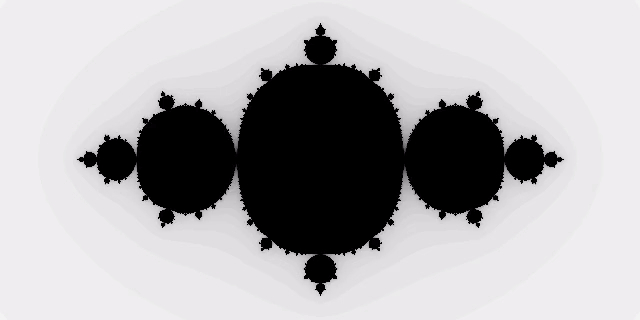

# 太极图形课S1-hw1-双摆(Double Pendulum)
利用taichi的并行特性实现了多个双摆同时运动

## 背景简介
> 双摆是将一根单摆连接在另一个单摆的尾部所构成的系统。双摆同时拥有着简单的构造和复杂的行为。高能量双摆的摆动轨迹表现出对于初始状态的极端敏感。
--Wiki


## 成功效果展示
这里可以展示这份作业（项目）run起来后的可视化效果，可以让其他人更直观感受到你的工作


## 整体结构（Optional）
脉络清晰的结构能完整展示你的设计思想，以及实现方式，方便读者快读代入，建议可以在repo的目录中包含如下内容：
这个部分希望大家可以大作业中加入，小作业中可以选择性加入（如果不加也是OK的）
```
-LICENSE
-|data
-README.MD
-xxx.py
```

## 运行方式

 `python3 double_pendulum.py`
